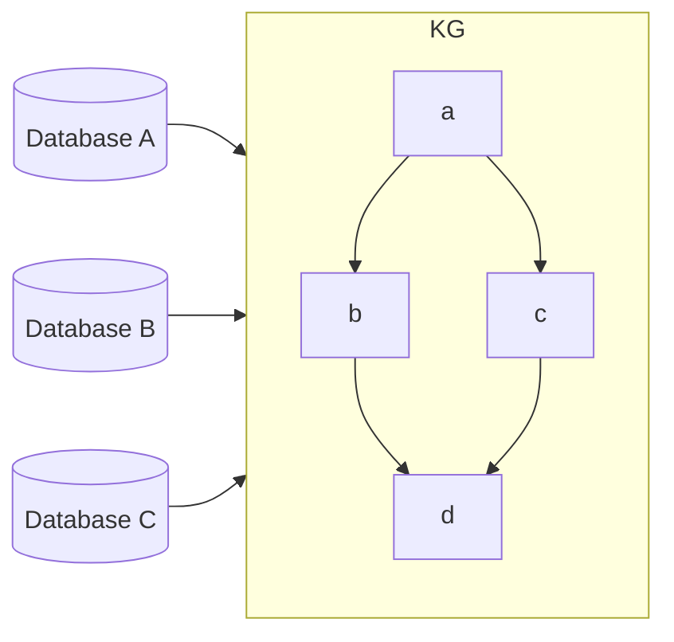

# Bridge

The objective of this project is to compile multiple dynamic data stores that can be queried semantically, and automatically builds relational understanding of information from various sectors.

# Relational Knowledge Graph

## Features
- Vector Search
- Supports many data formats (SQL, unstructured text, CSVs)

